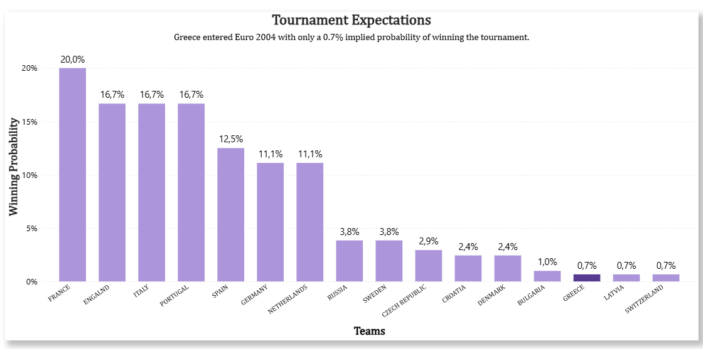
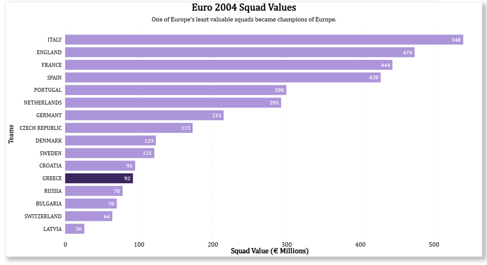
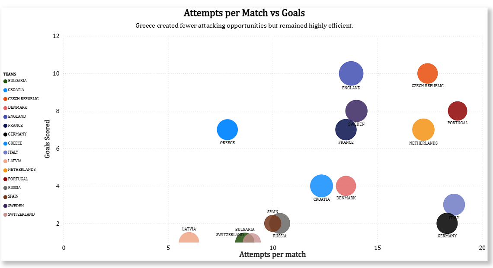
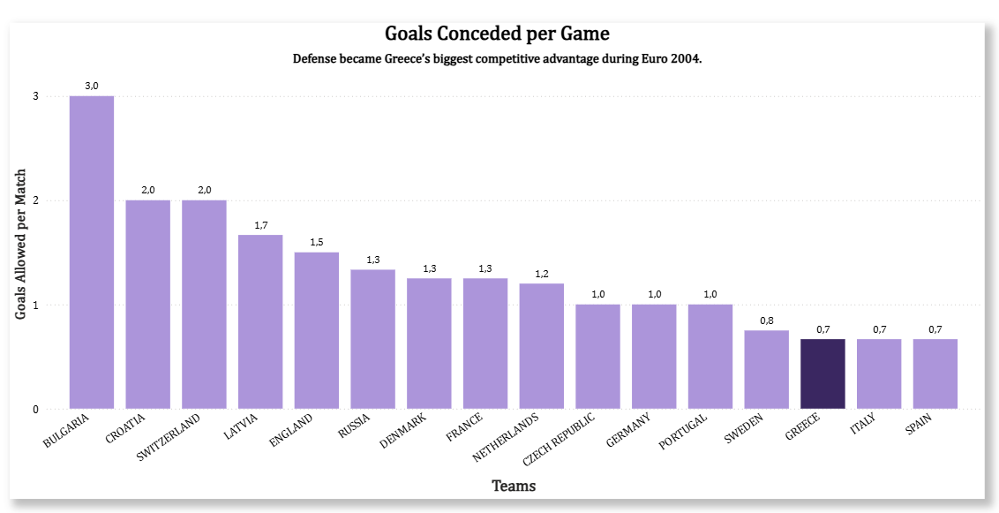
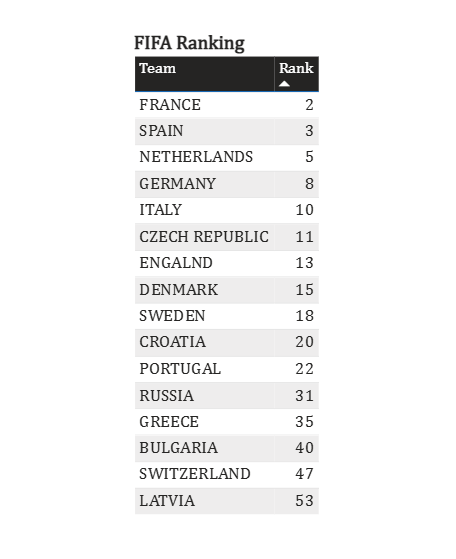

# How Greece Shocked Europe — Euro 2004 Data Analysis

## Overview

This project explores how Greece achieved one of football’s greatest underdog stories by winning UEFA Euro 2004 despite entering the tournament with extremely low expectations.

Using historical football data, betting probabilities, squad valuations, and tournament statistics, the analysis highlights the tactical efficiency and defensive organization behind Greece’s historic triumph.

---

## Tools Used

- Power BI
- Excel

---

## Key Insights

- Greece entered Euro 2004 with only a 0.7% implied probability of winning the tournament.
- Greece had one of the tournament’s lowest squad values.
- Greece created fewer attacking opportunities than most tournament favorites.
- Defensive consistency became Greece’s biggest competitive advantage.

---

# Dashboard Visuals

## Tournament Expectations

---

## Squad Value Comparison

---

## Attempts per Match vs Goals

---

## Goals Conceded per Game

---

## FIFA Ranking 2004

---

## Data Source

- UEFA Euro 2004 statistics
- Transfermarkt historical squad values
- Historical betting odds
- FIFA World Rankings
